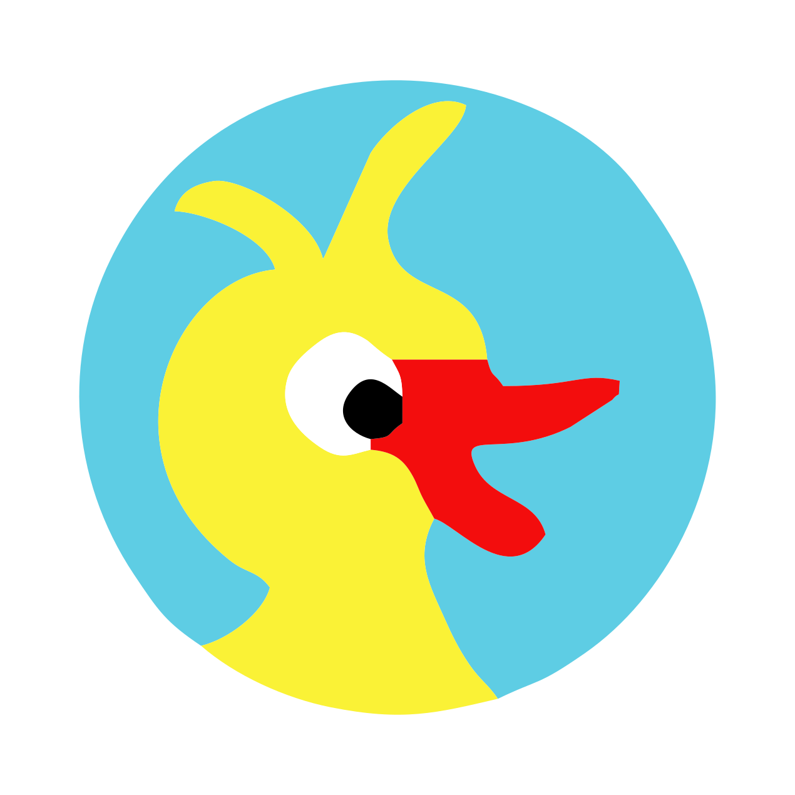
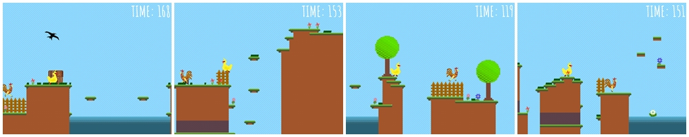

# Duck Adventure

  
  

  Simple and funny pixel-art game 2D platformer.
  

  
 
    <a href="https://cecherz.itch.io/duck-adventure">
      <b>Play online</b>
    </a>
  

## Screens:

## Changelog:

* **Version 1.2**
  - add sound
  - add game sountracks
* **Version 1.1**
  - fix level design 
  - fix visual errors
  - change start menu (web version) 
* **Version 1.0**
  - add HUD timer 
  - add start menu
  - create new game logo 
* **Version 0.3_beta** add trird level
* **Version 0.2_beta** add second level and new enemy
* **Version 0.1_beta** first level prototype

## Credits: 

### Programming and concept:

* [Kamil Cecherz](https://cecherz.pl/)

### Terrain design & level projects:

* [Kamil Cecherz](https://cecherz.pl/)

### Character design & logo project:

* [Agnieszka Lasota](https://www.facebook.com/profile.php?id=100005252026390)

### Fonts:

Google Fonts - contributors:
* [AmaticSC](https://github.com/googlefonts/AmaticSC)

### Music and sounds:

* Jump SFX [cabled_mess](https://freesound.org/people/cabled_mess/sounds/350898/)
* Hit SFX [Anthousai](https://freesound.org/people/Anthousai/sounds/406262/)
* Start melody [Mrthenoronha](https://freesound.org/people/Mrthenoronha/sounds/520710/)
* Game soundtrack [ZHRØ](https://freesound.org/people/ZHR%C3%98/sounds/668879/)
* Win melody [LittleRobotSoundFactory](https://freesound.org/people/LittleRobotSoundFactory/sounds/270528/)

### Test and suggestions:

* [Łukasz Bednarski](https://github.com/Bedzik)

