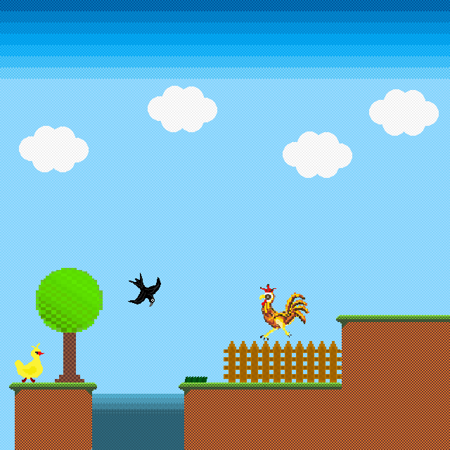

# Duck Adventure

  
  

  Simple and funny pixel-art game 2D platformer.
  

  
 
    <a href="https://cecherz.itch.io/duck-adventure">
      <b>Play online</b>
    </a>
  

## Screens

## Changelog

* **Version 0.2_beta** add second level and new enemy
* **Version 0.1_beta** first level prototype

## Credits 

### Programming and concept:

* [Kamil Cecherz](https://cecherz.pl/)

### Art game design:

* [Kamil Cecherz](https://cecherz.pl/)
* [Agnieszka Lasota](https://www.facebook.com/profile.php?id=100005252026390)
